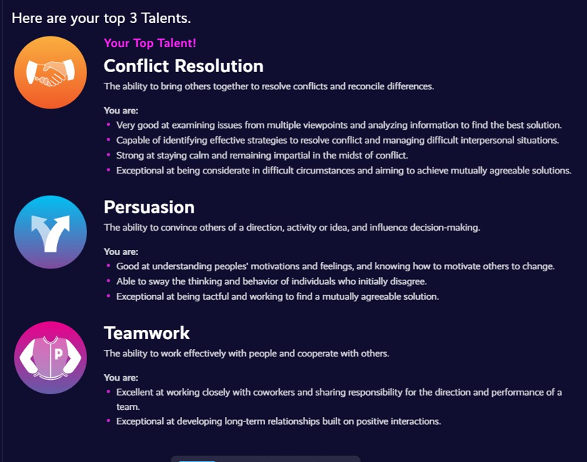

According to [Plum](https://secure.plum.io/p/HnXkQli7a-p6e2aWyyksXg) my top talents are **Conflict Resolution, Persuasion** and **Team Work**. This triumvirate is indispensable for **Leadership**. Conflict Resolution ensures harmony amidst diversity, turning challenges into opportunities. Persuasion instills conviction in our vision, rallying others towards a shared goal. Teamwork weaves a tapestry of collective strength, where each thread contributes to the fabric of success. Together, these talents form the cornerstone of effective leadership, fostering collaboration, resilience, and progress.

[]

